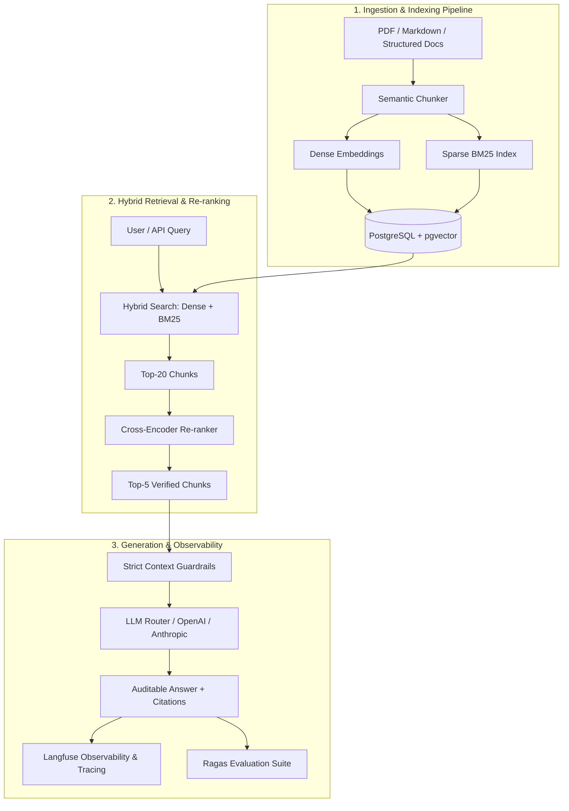

# 🧠 AI Knowledge Platform: Advanced Enterprise RAG Engine

[](https://www.python.org/)
[](https://fastapi.tiangolo.com/)
[](https://github.com/pgvector/pgvector)
[](https://github.com/explodinggradients/ragas)
[](https://www.docker.com/)
[](https://opensource.org/licenses/MIT)

A production-grade AI system engineered for **high-precision document retrieval and verified answer generation (RAG)** over complex corporate and technical corpora, eliminating hallucinations through deterministic citations and continuous evaluation suites.

---

## 🎯 The Real-World Engineering Problem

Most LLM implementations in enterprises fail due to the limitations of **"Naive RAG"** (basic dense embedding search + naive prompt injection):
1. **Sparse Accuracy Loss:** Dense vector search struggles with exact alphanumeric identifiers, part numbers, and statutory clauses.
2. **Context Poisoning:** Irrelevant chunks pollute context windows, inflating token costs and triggering model confusion.
3. **Zero Traceability:** Responses lack granular paragraph/page-level citations, preventing compliance and human auditability.

### 💡 Architectural Solution
We built an end-to-end 4-layer retrieval & evaluation pipeline:
* **Hybrid Retrieval:** Dense Embeddings (Semantic) + Sparse BM25 (Keyword Match) natively indexed in PostgreSQL with `pgvector`.
* **Cross-Encoder Re-ranking:** Fine-grained re-ordering of top candidates to maximize relevance before LLM ingestion.
* **Structured Output & Verifiable Citations:** Strict JSON schema guarantees linking each statement to exact page/paragraph source coordinates.
* **Continuous Evaluation (Evals):** Automated CI pipelines measuring *Faithfulness* and *Answer Relevance* powered by **Ragas** and **Langfuse**.

---

## 🏗️ System Architecture



---

## ⚡ Quickstart (Local Docker Stack)

### 1. Clone the repository and configure environment
```bash
git clone https://github.com/wilclefison/ai-knowledge-platform.git
cd ai-knowledge-platform
cp .env.example .env
```

### 2. Boot up the services (PostgreSQL + pgvector + Redis + FastAPI App)
```bash
docker compose up -d
```

### 3. Verify API Health & Swagger Documentation
Open your browser at: `http://localhost:8000/docs`

---

## 📊 Empirical Retrieval Benchmarks

| Retrieval Strategy | Faithfulness Score | Answer Relevance | Latency (p95) | Average Cost / Query |
| :--- | :--- | :--- | :--- | :--- |
| **Naive RAG (Dense Embeddings only)** | 0.72 | 0.68 | ~850ms | $0.008 |
| **Hybrid Search (Dense + BM25)** | 0.84 | 0.81 | ~920ms | $0.008 |
| **Hybrid + Cross-Encoder Reranker** | **0.96** | **0.94** | **~1.15s** | **$0.004 (Fewer tokens)** |

---

## 🧪 Test Suite & Evals Execution

```bash
# Run unit & integration tests
pytest tests/ -v

# Execute the automated Ragas evaluation suite
python evals/run_evals.py
```

---

## 👤 Author
**Wilclefison Lima**
* LinkedIn: [linkedin.com/in/wilclefison](https://www.linkedin.com/in/wilclefison)
* GitHub: [@wilclefison](https://github.com/wilclefison)
